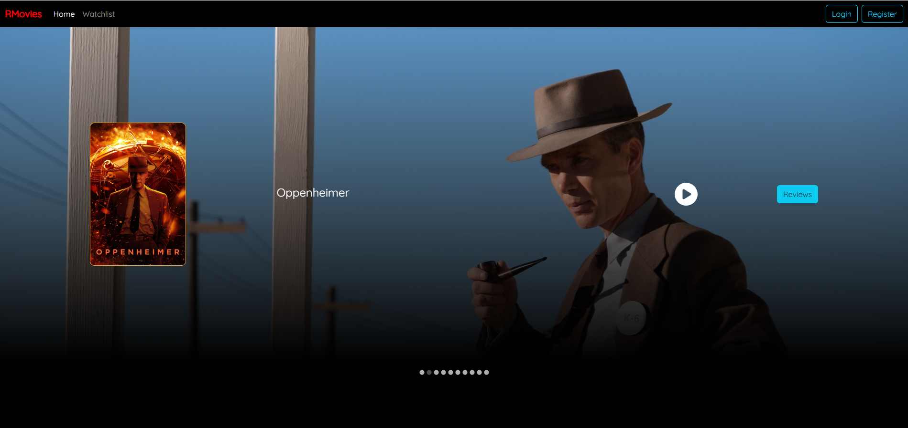

# RMovies

RMovies is an all-inclusive movie review app with a robust full-stack architecture. The Java backend, powered by the Spring Boot framework, seamlessly communicates with the React-based frontend. MongoDB handles efficient data management, ensuring flexibility and scalability.

Security is prioritized with JWT-based authentication, allowing users to securely log in and personalize their experience. Dev Container and Docker Compose streamline the development environment, providing consistency for developers.

Notably, RMovies offers a user-friendly watchlist feature. Once logged in, users can easily add their favorite movies, enhancing the personalized experience within the app. With a focus on security, efficiency, and user engagement, RMovies is a comprehensive solution for movie enthusiasts.



## Top Features
- User Authentication: Secure user authentication system to allow users to register and login with created accounts.
- Browse Movies: Users can explore a vast collection of movies with detailed information.
- Watchlist: Users can add their favorite movies to watchlist.
- Write Reviews: Registered users can write and submit reviews for their favorite movies.
- Responsive UI: The user interface is responsive and optimized for various devices, ensuring a seamless user experience.

## Dev Container

Dev Container facilitates **development environment as code**, ensuring a consistent and reproducible setup. This project offers a one-click development setup using [Dev Container](https://code.visualstudio.com/docs/devcontainers/containers), accessible via GitHub Codespaces or Visual Studio Code with Docker Desktop and Dev Containers extensions.

- **Consistent Development Environment:**
  - Development environment defined as code for consistency across team members.
  - One-click setup ensures that everyone uses the same environment.

- **Automated MongoDB Setup:**
  - Docker Compose automatically initiates a MongoDB database service upon launching the dev container.

- **Pre-configured Visual Studio Code Environment:**
  - Essential Visual Studio Code extensions are pre-configured for a seamless development experience.

- **Direct Server Build and Run:**
  - Included launch.json and tasks.json files enable direct server build and run within the IDE.

## Technologies

- Backend: Java, Spring Boot
- Frontend: JavaScript, React, JSX, CSS, Node.js
- Database: MongoDB
- Development: Dev Container, Docker Compose, Visual Studio Code

## Getting Started

### Option 1: GitHub Codespaces with Dev Container

1. On GitHub, click `Code` > `Codespaces` > `Create Codespaces on main` or use the badge below:

   [](https://github.com/codespaces/new?hide_repo_select=true&ref=main&repo=604053198)

2. Wait for Visual Studio Code extensions to install. In `Run and Debug` view, select `Backend+Frontend` and press `F5` to run both servers. Open the app at port `3000` in the browser.

### Option 2: Visual Studio Code with Dev Container

1. Install Visual Studio Code and [Dev Containers extension](https://marketplace.visualstudio.com/items?itemName=ms-vscode-remote.remote-containers).
2. Install [Docker Desktop](https://www.docker.com/products/docker-desktop/).
3. Open the project in Visual Studio Code, press `F1`, type and select `Dev Containers: Open Folder in Container`.

### Option 3: Any Code Editor without Dev Container

1. Install required software: code editor, Docker Desktop, JDK 17, Node.js 18, MongoDB 7.
2. Manually start services.

Database:

   ```bash
   cd .devcontainer
   docker compose up -d mongodb
```

Backend:

```bash
cd backend
./mvnw spring-boot:run 
```

Frontend:

```bash
cd frontend
npm install 
npm start   
```

Open the browser and connect to http://localhost:3000 to play with the app.

## CORS handling

Developers often encounter the Cross-Origin Resource Sharing (CORS) error, a security check implemented by browsers when making cross-origin frontend API requests to the backend.

This project takes advantage of the proxy feature of Create React App to align the origin (both the host and the port) of API requests to the backend server with that of the frontend app. Thus, the backend does not need to respond with Access-Control-Allow-Origin: * in the HTTP header, which is not recommended in production.

## Dev Container configuration

### Docker image

-   Ubuntu 2022.04
-   OpenJDK 17
-   Node.js 18
-   MongoDB 7

### Visual Studio Code extensions

-   Docker
-   Extension Pack for Java (Java language server and tools)
-   Prettier (Code formatting)
-   EditorConfig for VS Code
-   ES7+ React/Redux/React-Native snippets
-   MongoDB for VS Code
-   Path Intellisense
-   Code Spell Checker

